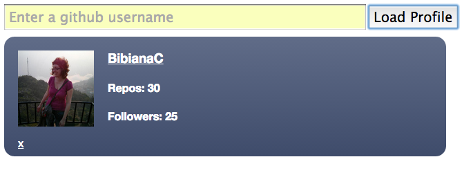

# Node, APIs and Ajax

Learning how to build responsive applications using JavaScript across the whole stack. Build our own version of the remotely accessible Github API (Application Programming Interface), as well as used Ajax to access it dynamically from the browser.

## Screenshot

  

## Context

Week 7 project at Makers Academy

## Resources

- Javascript
- JQuery
- NodeJs
- Express
- Grunt
- Mocha-casperjs
- NPM
- GitHub API

## Contributors

- [Marcin Walendzik](https://github.com/marcinwal)
- Bibiana Cristòfol